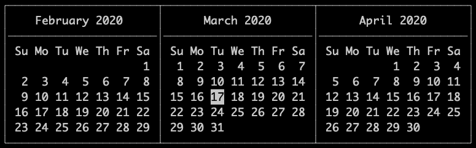
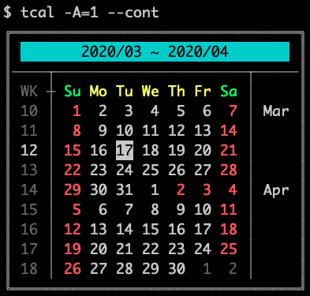
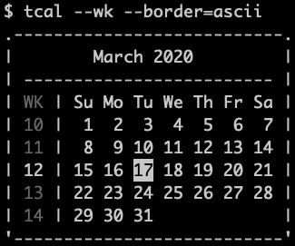
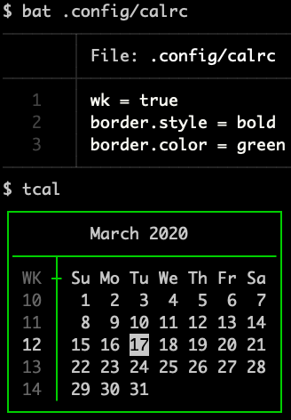
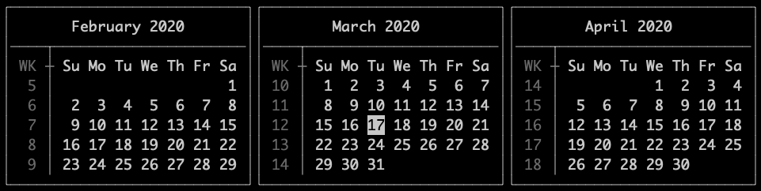
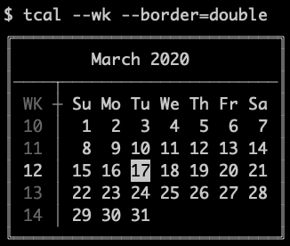

===============================================================================
Tinycal
===============================================================================
A Python implementation of ``cal`` command.

Story
-------------------------------------------------------------------------------
My Mac has a built-in ``cal`` command, but it has no color at all.
It's hard to see which day is today.

I found the other ``cal`` implementation in a single C file.
After modify it's source code a little bit, I was able to build it.
It worked well for a long period of time.

Sometimes I need to know the week number of a day, but ``cal`` didn't provide such argument.
I have to check my employee badge over and over again.

"NO, we programmers exists to solve problems! At least our own problems."

Here comes tinycal.

Installation
-------------------------------------------------------------------------------
::

  $ pip install --upgrade tinycal

Add ``--user`` if you need.

Or, if you don't have access to PyPI, you can still install it by hand:

1.  Put the repository into your favorite folder, like ``~/bin/tinycal/``
2.  Put a shell script into ``~/bin/``, named ``tcal`` ::

      #!/usr/bin/env sh
      cd ~/bin/tinycal/ && python -m tinycal "$@"

Make sure ``~/bin/`` is in your ``$PATH``.

It's just an example, you can decide which place to put.

Usage
-------------------------------------------------------------------------------
Tinycal comes with a command utility ``tcal``.
It's command line argument design is mostly based on the classical ``cal``.

A snapshot of help page here:

::

  usage: tcal [-h] [--version] [--col COL] [-A AFTER] [-B BEFORE] [-3] [-w] [-W]
              [-b [BORDER]] [-f] [-F] [--color [{never,always,auto}]] [-c] [-C]
              [-l {jp,zh,en}] [-j] [-z] [-e] [-m] [-M] [--cont] [--marks MARKS]
              [--today TODAY]
              [year] [month]

  tinycal: A Python implementation of cal utility.

  positional arguments:
    year                  Year to display.
    month                 Month to display. Must specified after year.

  optional arguments:
    -h, --help            show this help message and exit
    --version, -v         show program's version number and exit
    --col COL             Specify the column numbers.
    -A AFTER              Display the number of months after the current month.
    -B BEFORE             Display the number of months before the current month.
    -3                    Equals to -A 1 -B 1.
    -w, --wk              Display week number.
    -W, --no-wk           Don`t display week number.
    -b [BORDER], --border [BORDER]
                          Comma separated keywords to describe borders.
                          Valid keywords: full,basic,off,ascii,single,bold,double,weld,noweld
    -f, --fill            Fill every month into rectangle with previous/next month dates.
    -F, --no-fill         Don`t fill month into rectangle.
    --color [{never,always,auto}]
                          Enable/disable VT100 color output.
    -c                    Enable VT100 color output, equals to --color=always
    -C                    Disable VT100 color output, equals to --color=never
    -l {jp,zh,en}, --lang {jp,zh,en}
                          Select the language used to display weekdays and month names.
    -j                    Equals to --lang=jp.
    -z                    Equals to --lang=zh.
    -e                    Equals to --lang=en.
    -m                    Use Monday as first weekday.
    -M                    Use Sunday as first weekday.
    --cont                Show the calendar in contiguous mode.
    --marks MARKS         Specify the date marking file.
    --today TODAY         Date that treated as today in format yyyy/mm/dd, used for debugging.

  Configuration files: ('~/.config/calrc', '~/.calrc')

Example usage:

Configuration File
-------------------------------------------------------------------------------
Tinycal finds its configuration file in the following order:

1.  ``~/.config/calrc``
2.  ``~/.calrc``

Here is the full set of configurable options, with default values:

::

  col = 3
  after = 0
  before = 0
  wk = false
  sep = true
  fill = false

  # Single choice: full / basic / off
  border = full

  # Single choice: ascii / single / bold / double
  border.style = single

  border.color = none:none
  border.weld = true

  start_monday = false

  # The path to date marking file.
  marks = <no-default>
  # Format: yyyy/mm/dd color

  # Single choice: en / zh / jp
  lang = en

  wk.color = BLACK
  fill.color = BLACK
  title.color = none:none
  weekday.color = none:none
  weekday.sunday.color = none:none
  weekday.monday.color = none:none
  weekday.tuesday.color = none:none
  weekday.wednesday.color = none:none
  weekday.thursday.color = none:none
  weekday.friday.color = none:none
  weekday.saturday.color = none:none
  sunday.color = none:none
  monday.color = none:none
  tuesday.color = none:none
  wednesday.color = none:none
  thursday.color = none:none
  friday.color = none:none
  saturday.color = none:none
  today.color = none:white
  today.wk.color = (brighter version of wk.color)

The ordering is not important.

For color settings, use ``foreground:background`` format to describe colors.

Recognized colors: ``black``, ``red``, ``green``, ``yellow``, ``blue``, ``magenta``, ``cyan``, ``white``.

If every letter in foreground is capitalized (e.g. ``RED``), the color will be bright.

Several color configurations may refer to a same day (like ``today`` and ``saturday``).
The more specific setting overrides the other.

For example, this configuration:

::

  col = 4
  wk = true
  border = full
  border.style = double
  fill = true

  marks = ~/.calmarks

  title.color = black:cyan
  today.color = black:white
  weekday.color = YELLOW
  weekday.sunday.color = GREEN
  weekday.saturday.color = GREEN
  sunday.color = RED
  saturday.color = RED

looks like this:

Gallery
-------------------------------------------------------------------------------

Classical ASCII border:

Bold border (with tweaks):

Single-lined border, with ``noweld`` option:

Doubled-lined border:

Test
-------------------------------------------------------------------------------
::

  $ python -m unittest -v tests/testcases.py

License
-------------------------------------------------------------------------------
This software is released under 2-clause BSD license, please refer to LICENSE.txt.
