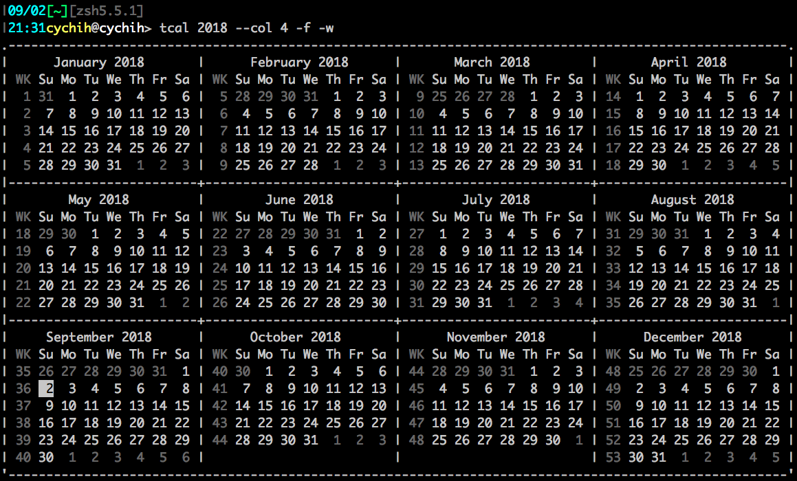
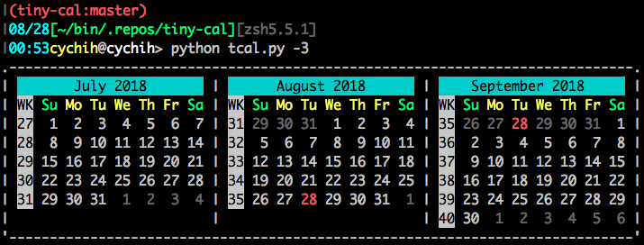

===============================================================================
Tinycal
===============================================================================
A Python implementation of ``cal`` command.

Story
-------------------------------------------------------------------------------
My Mac has a built-in ``cal`` command, but it has no color at all.
It's hard to see which day is today.

I found the other ``cal`` implementation in a single C file.
After modify it's source code a little bit, I was able to build it.

And it worked for a long period of time.

One day I need to know the week number of a day.
But ``cal`` didn't provide such argument, so I have to flip my badge over and
over again.

"NO, we RD exists to solve problems! At least our own problems..."

Here comes tinycal.

Usage
-------------------------------------------------------------------------------
tinycal comes with a command utility ``tcal``.
It's command line argument design is mostly based on traditional ``cal``.

A snapshot of help page here:

::

  $ python tcal.py -h
  usage: tcal.py [-h] [--col COL] [-A AFTER] [-B BEFORE] [-3] [-w] [-W] [-s]
                 [-S] [-b] [-nb] [-f] [-F] [-c] [-C] [-j] [-J] [-m] [-M]
                 [year] [month]

  Tiny cal

  positional arguments:
    year              Year to display.
    month             Month to display. Must specified after year.

  optional arguments:
    -h, --help        show this help message and exit
    --col COL         Specify the column numbers.
    -A AFTER          Display the number of months after the current month.
    -B BEFORE         Display the number of months before the current month.
    -3                Equals to -A 1 -B 1.
    -w                Display week number.
    -W                Don`t display week number.
    -s, --sep         Display separation lines.
    -S, --no-sep      Don`t display separation lines.
    -b, --border      Display border lines.
    -nb, --no-border  Don`t display border lines.
    -f, --fill        Fill every month into rectangle with previous/next month
                      dates.
    -F, --no-fill     Don`t fill month into rectangle.
    -c                Enable VT100 color output.
    -C                Disable VT100 color output.
    -j                Enable Japanese weekday names.
    -J                Disable Japanese weekday names.
    -m                Use Monday as first weekday.
    -M                Use Sunday as first weekday.

Example usage:

Configuration File
-------------------------------------------------------------------------------
Hey, you are not leaving :D

tinycal finds its configuration file in this order:

1.  ``~/.config/.calrc``
2.  ``~/.calrc``

Here is the full set of configurable options, with default values:

::

  col = 3
  after = 0
  before = 0
  wk = false
  sep = true
  fill = false
  border = true
  start_monday = false
  lang = en

  wk.color = BLACK
  today.color = black:white
  fill.color = BLACK
  title.color = none:none
  weekday.color = none:none
  weekday.sunday.color = none:none
  weekday.monday.color = none:none
  weekday.tuesday.color = none:none
  weekday.wednesday.color = none:none
  weekday.thursday.color = none:none
  weekday.friday.color = none:none
  weekday.saturday.color = none:none

For color settings, use ``foreground:background`` format to describe colors.

Recognized colors: ``black``, ``red``, ``green``, ``yellow``, ``blue``, ``magenta``, ``cyan``, ``white``.

If every letter in foreground is capitalized, the color will be bright.

This configuration:

::

  col = 5
  sep = true
  wk = true
  border = true
  fill = true

  title.color = black:cyan
  wk.color = black:white
  today.color = RED
  weekday.color = YELLOW
  weekday.sunday.color = GREEN
  weekday.saturday.color = GREEN

looks like this:

If it looks ugly, I'm sorry :(

But you can design your own configuration anyway :)

License
-------------------------------------------------------------------------------
This software is released under 2-clause BSD license, please refer to LICENSE.txt.
